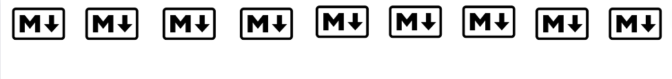

# ⬇️Markdown⬇️
### 📑Conteúdos neste repositório:
1. [Guia_Markdown](C:\Users\tauane\Desktop\Markdown\Guia_Markdown.md): exemplos de códigos e aplicação
2. [Resumo](Resumo.md): forma simplificada do Guia para consultas rápidas, sem exemplos
3. [Curiosidades](Curiosidades.md): a história do markdown, alguns fatos interresantes e anotações pessoais
***
🚨O [Guia_Markdown](C:\Users\tauane\Desktop\Markdown\Guia_Markdown.md) será estruturado em: primeiro o código e depois a aplicação, exemplo: 
```
#### Código para criar o Título 4
```
#### Título 4 na prática

***
### 🌐Fontes:
- Só vou deixar no guia o que funciona aqui no Git Hub, existe vários comandos que encontrei e não foram formatados aqui, talvez em outros sim, então vale a pena dar uma olhada nesses sites:
1. [Guia de Markdown do Gustavo Guanabara](https://github.com/gustavoguanabara/git-github/blob/master/manuais-PDF/guia-markdown.pdf)
2. [Guia de markdown - em espanhol](https://github.com/AlanIsaacV/Markdown/blob/master/Guia%20de%20markdown.md)
3. [CommonMark](https://commonmark.org/)
4. [Markdownguide](https://www.markdownguide.org/getting-started/)
5. [Ikatyang - emojis](https://github.com/ikatyang/emoji-cheat-sheet)
6. [Ferramentas para escrever em Markdown](https://andybrandt531.com/2015/03/markdown-for-bloggers-part-6-monster-list-of-markdown-tools/)
7. [Frugal Guidance 2](https://andybrandt531.com/2015/03/markdown-for-bloggers-part-6-monster-list-of-markdown-tools/)  
8. [Awesome Markdown](https://github.com/webiaio/awesome-markdown.git)
9. [Markdown Cheat Sheet](https://www.markdownguide.org/cheat-sheet/)
10. [Microsoft - markdown](https://learn.microsoft.com/pt-br/azure/devops/project/wiki/markdown-guidance?view=azure-devops)
11. [Site para criar tabelas](https://www.tablesgenerator.com/markdown_tables)


***
**🆘Contribua para tornar esse guia mais completo**  
***
